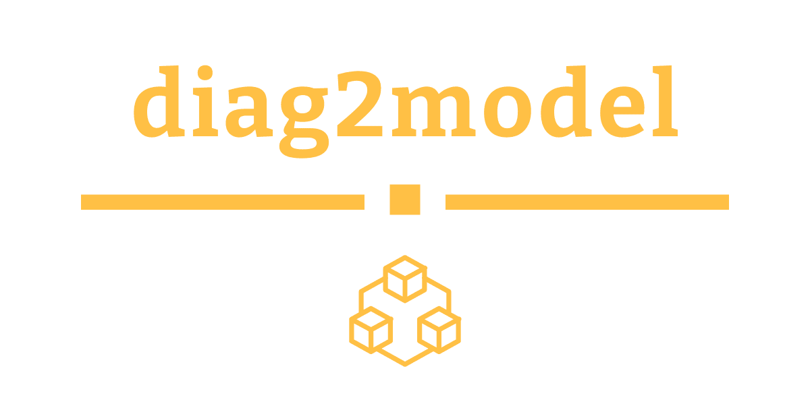

### Implementations of Artificial Neural Networks Based on their Diagrams

## Authors
* Milad Sadeghi DM - [EverlookNeverSee@GitHub](https://github.com/EverLookNeverSee)
* List of [all contributors](https://github.com/EverLookNeverSee/diag2model/graphs/contributors) to this repository

## Implemented Models
* [PLNet](models/pl_net/pl_net.py) - Convolutional Neural Network with Parallel Layers
* [MLANet](models/mla_net/mla_net.py) - Convolutional Neural Network with Multiple Layer Additions
* [LeNet-5](models/lenet_5/lenet-5.py) - Gradient-Based Learning Applied to Document Recognition
* [AlexNet](models/alexnet/alexnet.py) - ImageNet Classification with Deep Convolutional
Neural Networks
* [VGG-16](models/vgg_16/vgg-16.py) - Very Deep Convolutional Networks For Large Scale Image Recognition
* [Inception-v1](models/inception_v1/inception-v1.py) - Going Deeper With Convolutions

## License
This project licensed under the MIT License - see the [LICENSE](LICENSE) file for more details.
